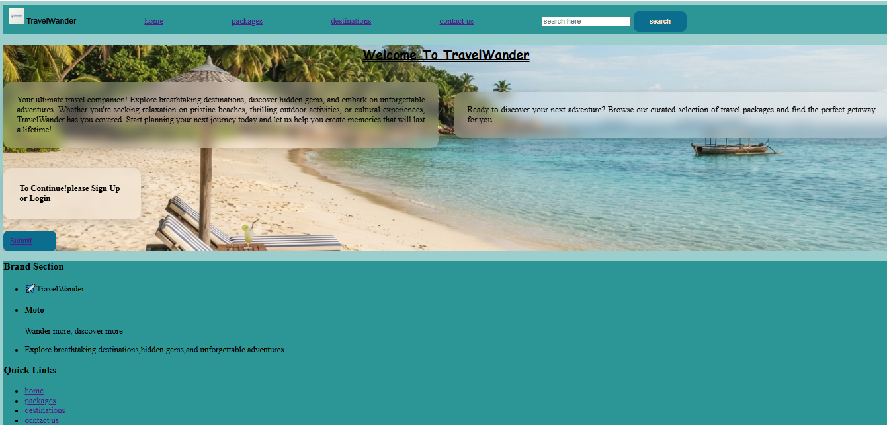
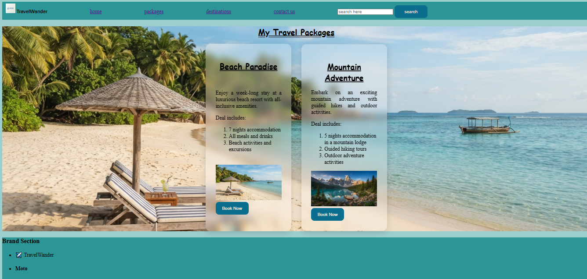
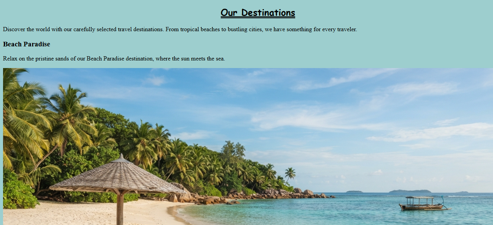
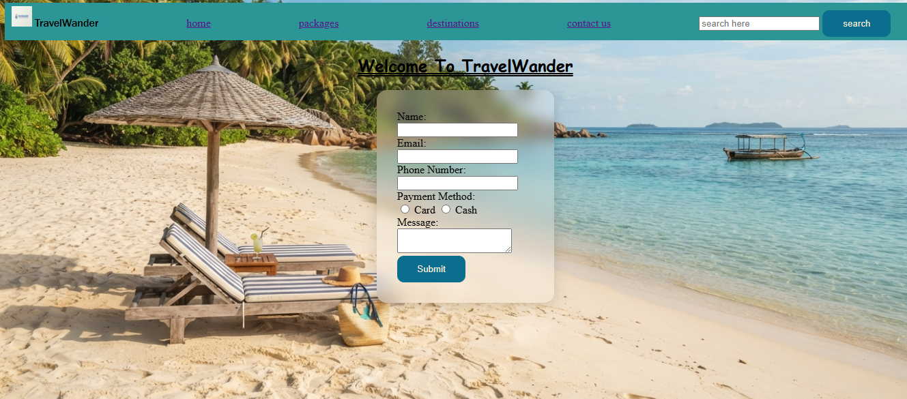

# TravelWander 🌴✈️

TravelWander is a simple travel website built with HTML and CSS. It showcases travel packages, destinations, and allows users to sign up or log in to explore more.

## 🔗 Live Site
[https://wafazahra124-bot.github.io/TravelWander/](https://wafazahra124-bot.github.io/TravelWander/)

## 📄 Pages

### Home (`index.html`)
Landing page with a welcome message and intro to TravelWander.


### Packages (`packages.html`)
Browse curated travel packages.


### Destinations (`destination.html`)
Explore travel destinations.


### Contact (`contact.html`)
Get in touch.


### Login (`login page.html`)
Sign up or log in to continue.


### Thank You (`thankyou.html`)
Confirmation page.


## 🛠️ Built With
- HTML5
- CSS3

## 📁 Project Structure

TravelWander/
├── index.html
├── packages.html
├── destination.html
├── contact.html
├── login page.html
├── thankyou.html
├── styles.css
└── images/
├── beech.jpg
├── mountains.jpg
├── travelwanderlogo.jpg
├── home.PNG
├── packages.PNG
├── destinations.PNG
├── contact.PNG
├── login.PNG
└── thankyou.PNG


## 🚀 Getting Started
To run this project locally:
1. Clone the repository
```bash
   git clone https://github.com/wafazahra124-bot/TravelWander.git
```
2. Open `index.html` in your browser

## 📌 Status
This is a work-in-progress student/practice project focused on learning HTML and CSS layout, styling, and GitHub deployment.

## ✍️ Author
Wafa

